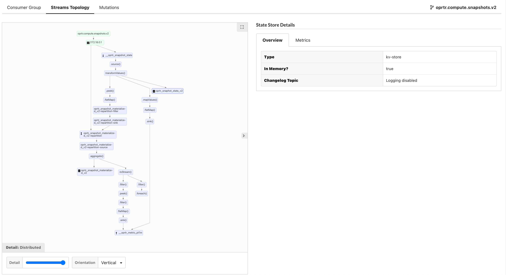

[](https://github.com/operatr-io/streams-agent/actions/workflows/test.yml)
[](https://search.maven.org/search?q=g:%22io.operatr%22%20AND%20a:%22kpow-streams-agent%22)

# [kPow](https://kpow.io) Streams Agent

kPow's Kafka Streams agent. Install this agent to monitor Kafka Streams applications with [kPow](https://kpow.io)

[Documentation](https://docs.kpow.io/features/kafka-streams)



# Installation

kPow's streams agent can be found on [Maven Central](https://search.maven.org/artifact/io.operatr/kpow-streams-agent):

```xml
<dependency>
  <groupId>io.operatr</groupId>
  <artifactId>kpow-streams-agent</artifactId>
  <version>0.2.5</version>
  <type>bundle</type>
</dependency>
```

# Prerequisites

kPow's Streams Agent requires a running instance of kPow. 

To get up and running with kPow, visit the [kpow-local](https://github.com/operatr-io/kpow-local) repo or visit our [Quick Start](https://docs.kpow.io/installation/quick-start) guide.

# Usage

To instrument a Kafka Streams application, create a new instance of a `StreamsRegistry` and register your `KafkaStreams` + `Topology` instances against it.

```java 
import io.operatr.kpow.StreamsRegistry;

// Your Kafka Streams topology
Topology topology = new Topology(); 

// Your Kafka Streams config
Properties streamsProps = new Properties();
 
// Your Kafka Streams instance
KafkaStreams streams = new KafkaStreams(topology, streamsProps); 

// kPow Producer properties for the Kafka cluster that Streams metrics will be sent (and where kPow should be installed).
Properties props = new Properties(); 

// kPow Streams Registry to periodically capture and send metrics with the Producer properties above
StreamsRegistry registry = new StreamsRegistry(props);

// Register your Kafka Streams instance with the kPow StreamsRegistry
registry.register(streams, topology); 

// Start your Kafka Streams application
streams.start();
```

Once configured, metrics will be periodically sent to kPow's internal snapshot topic. You will be able to monitor your streams application from within kPow and externally via [Prometheus egress](https://docs.kpow.io/features/prometheus)

For more information read the [documentation](https://docs.kpow.io/features/kafka-streams)

## Deployment scenarios

### Simple

If kPow is configured to monitor only a single Kafka cluster, you can reuse your Kafka Streams `Properties` file:

```java
Properties streamsProps = new Properties();
KafkaStreams streams = new KafkaStreams(topology, streamsProps); 
StreamsRegistry registry = new StreamsRegistry(streamsProps);
```

### Multi-cluster kPow + Streams Registry

The `Properties` instance you pass to `StreamsRegistry` must contain configuration details for your **primary** Kafka cluster. Your primary Kafka cluster is the cluster housing internal kPow topics like `__oprtr_snapshot_state`.

Visit [kPow's documentation](https://docs.kpow.io/config/multi-cluster) to read more about multi-cluster.

### Registring multiple KafkaStreams instances for a single app

You can call the `register` method many times to register multiple streams apps:

```java
KafkaStreams dedupeStreams = new KafkaStreams(dedupeTopology, dedupeProps);
KafkaStreams paymentStreams = new KafkaStreams(paymentTopology, paymentProps);
registry.register(paymentStreams, paymentTopology);
registry.register(dedupeStreams, dedupeTopology);
```

## Troubleshooting 

### The Workflows UI is showing "Configure Streams Topology" for my consumer

This could happen for a few reasons:

1. `register` method has not been called.
2. Invalid connection details passed to `StreamsRegistry` constructor. If this is the case you will see Kafka producer exceptions in the logs of your streams application.
3. Telemetry is still being calculated. After a fresh deployment, it might take up to 2 minutes for initial streams telemetry to be calculated. 

You can verify `StreamsRegistry` is sending telemetry to your Kafka Cluster by using Data Inspect in kPow:

* Select topic `__oprtr_snapshot_state`
* Choose `Transit / JSON` as the key serde
* Enter the following kJQ filter for the key: `.[0] == :streams`


# Copyright and License

Copyright © 2021 Operatr Pty Ltd. 

Distributed under the Apache-2.0 License, the same as Apache Kafka.
