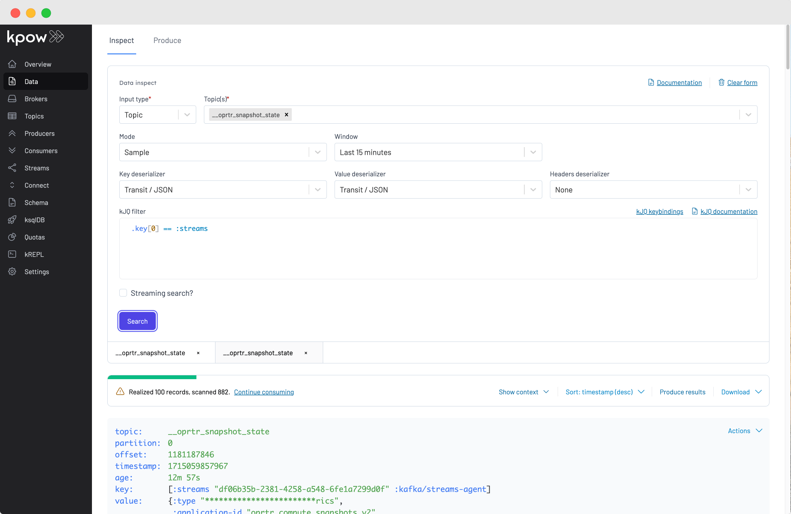

[](https://github.com/factorhouse/kpow-streams-agent/actions/workflows/test.yml)
[](https://central.sonatype.com/artifact/io.factorhouse/kpow-streams-agent)
[](https://javadoc.io/doc/io.factorhouse/kpow-streams-agent)


# Kpow Streams Agent

This repository contains the Kpow Streams Agent.

Use this agent to integrate your Kafka Streams applications with Kpow and unlock the following features:

* See summaries of Kafka Streams activity for your Kafka cluster(s).
* Monitor Kafka Streams metrics (e.g Streams State, Stream-Thread, State Store, RocksDB, etc).
* Visualise Kafka Streams topologies in the Kpow Workflows UI.
* Aggregate and Expose Kafka Streams metrics via Kpow [Prometheus Endpoints](https://docs.factorhouse.io/kpow-ee/features/prometheus/) (for alerting, etc).

See the [Kpow Kafka Streams Feature Guide](https://docs.factorhouse.io/kpow-ee/features/kafka-streams/) for full documentation.

See the [Kpow Kafka Streams Spring Word Count Example](https://github.com/factorhouse/kpow-streams-spring-cloud-example) for an integration of Spring, Kafka, and Kpow.

---


---


---

# Prerequisites

The Kpow Streams Agent requires a running instance of Kpow.

Evaluate Kpow with the [Kpow Local](https://github.com/factorhouse/kpow-local) repository or see our [Quick Start](https://docs.factorhouse.io/kpow-ee/installation/quick-start/) guide.

# Installation

The Kpow Stream Agent can be found on [Maven Central](https://search.maven.org/artifact/io.operatr/kpow-streams-agent).

Include the agent as a dependency in your Kafka Streams application.

```xml
<dependency>
  <groupId>io.operatr</groupId>
  <artifactId>kpow-streams-agent</artifactId>
  <version>0.2.12</version>
</dependency>
```

# Integration

In your application, just before you start your KafkaStreams instance:

* Create a new [io.factorhouse.kpow.StreamsRegistry](https://github.com/factorhouse/kpow-streams-agent/blob/main/src/java/io/factorhouse/kpow/StreamsRegistry.java) instance.
* Register your KafkaStreams and Topology instances with the StreamsRegistry.

```java 
import io.factorhouse.kpow.StreamsRegistry;
import io.factorhouse.kpow.key.ClusterIdKeyStrategy;

// Your Kafka Streams topology
Topology topology = createMyTopology();

// Your Kafka Streams config
Properties props = new createMyStreamProperties();

// Your Kafka Streams instance
KafkaStreams streams = new KafkaStreams(topology, props);

// Create a Kpow StreamsRegistry
StreamsRegistry registry = new StreamsRegistry(props);

// Specify the key strategy when writing metrics to the internal Kafka topic
KeyStrategy keyStrategy = new ClusterIdKeyStrategy(props);

// Register your KafkaStreams and Topology instances with the StreamsRegistry
registry.register(streams, topology, keyStrategy);

// Start your Kafka Streams application
streams.start();
```

The StreamsRegistry is a *single-threaded process* that performs these actions **once every minute**:

* Capture metadata about each registered Kafka Streams application.
* Produce snapshots to the Kpow internal `__oprtr_snapshot_state` topic.

The StreamsRegistry **does not talk directly to Kpow**. Kpow reads streams data from the snapshot topic.

# Metric filters

You can configure each streams registry with metric filters, which give you greater control over which metrics Kpow's streams agent will export.

Metric filters can be chained and added programmatically:

```java
import io.factorhouse.kpow.StreamsRegistry;
import io.factorhouse.kpow.MetricFilter;

MetricFilter metricFilter = MetricFilter().deny(); // don't send any streams metrics, just send through the Streams Topology

// ..

StreamsRegistry registry = new StreamsRegistry(props, metricFilter);
```

If you pass no metric filters to the `StreamsRegistry` constructor then the default metric filter will be used. The default metric filter will **accept** all metrics to be exported.

### Metric filter usage

Kpow's streams agent metric filters work very similar to Micrometer's [meter filters](https://github.com/micrometer-metrics/micrometer-docs/blob/main/src/docs/concepts/meter-filters.adoc).

Metric filters can either `ACCEPT` or `DENY` a metric. The filter itself is a Java predicate which takes in the [org.apache.common.MetricName](https://kafka.apache.org/0110/javadoc/org/apache/kafka/common/MetricName.html#group()) class. This allows you to filter metrics by name, tags or group.

Metric filters are applied sequentially in the order they are configured in the registry. This allows for stacking of deny and accept filters to create more complex rules:

```java
MetricFilter metricFilter = MetricFilter().acceptNameStartsWith("rocksdb").deny();
```
The above example allows all rocksdb related metrics through and denies all other types of streams metrics.

# Kafka connection

The `StreamsRegistry` `Properties` contains configuration to create the snapshot producer.

The StreamsRegistry configures its own Serdes on the snapshot producer, you do not need to set them.

Producer configuration means any of the following fields: 

* ssl.enabled.protocols
* sasl.client.callback.handler.class
* ssl.endpoint.identification.algorithm
* ssl.provider
* ssl.truststore.location
* ssl.keystore.key
* ssl.key.password
* ssl.protocol
* ssl.keystore.password
* sasl.login.class
* ssl.trustmanager.algorithm
* ssl.keystore.location
* sasl.login.callback.handler.class
* ssl.truststore.certificates
* ssl.cipher.suites
* ssl.truststore.password
* ssl.keymanager.algorithm
* ssl.keystore.type
* ssl.secure.random.implementation
* ssl.truststore.type
* sasl.jaas.config
* ssl.keystore.certificate.chain
* sasl.mechanism
* sasl.oauthbearer.jwks.endpoint.url
* sasl.oauthbearer.token.endpoint.url
* sasl.kerberos.service.name
* security.protocol
* bootstrap.servers

For more details visit the [Producer](https://kafka.apache.org/documentation/#producerconfigs) section of the Apache Kafka documentation.

### Key strategy

The keying strategy for data sent from Kpow's streams agent to its internal Kafka topic is configurable. The key strategy plays an important role in enabling Kpow to align stream metrics with the UI accurately. There are many key strategies available depending on your organisation's deployment.

#### Cluster ID (recommended key strategy, requires Kpow 94.1+)

The default key strategy uses the cluster ID, obtained via an AdminClient [describeClusters](https://kafka.apache.org/23/javadoc/org/apache/kafka/clients/admin/DescribeClusterResult.html) call. This AdminClient is created once during registry initialization and then closed. If you prefer not to have the streams registry create an AdminClient—either because your Kafka variant does not provide a cluster ID or due to security considerations—you may select an alternative key strategy from the options below.

```java
// Specify the key strategy when writing metrics to the internal Kafka topic
// props are java.util.Properties describing the Kafka Connection
KeyStrategy keyStrategy = new ClusterIDKeyStrategy(props);
// Register your KafkaStreams and Topology instances with the StreamsRegistry
registry.register(streams, topology, keyStrategy);
```

#### Client ID (default in 0.2.0 and below)

This key strategy relies on the client ID and application ID from the active KafkaStreams instance, eliminating the need for an AdminClient. However, in a multi-cluster Kpow deployment where the same application ID is used across multiple environments (e.g., staging, dev, prod), Kpow cannot determine which cluster the Kafka Streams instance is associated with.

```java

import io.factorhouse.kpow.key.ClientIdKeyStrategy;

KeyStrategy keyStrategy = new ClientIdKeyStrategy();
registry.register(streams, topology, keyStrategy);
```

#### Environment name (manual, requires Kpow 94.1+)

If you have set a UI-friendly cluster name using the `ENVIRONMENT_NAME` environment variable in Kpow, you can use this environment name as the keying strategy for the streams agent.

```java


// This sets a manual key of `Trade Book (Staging)`, the name of the clusters environment name in Kpow's UI.
KeyStrategy keyStrategy = new ManualKeyStrategy("Trade Book (Staging)");
registry.

        register(streams, topology, keyStrategy);
```

### Minimum Required ACLs

If you secure your Kafka Cluster with ACLs, the user provided in the Producer configuration must have permission to write to the internal Kpow topic.

```
./kafka-acls.sh \
  --bootstrap-server 127.0.0.1:9092 \
  --command-config client.conf \
  --add --allow-principal User:<your-producer-user> --operation Write --topic '__oprtr_snapshot_state'
```

### Produce to the Primary Cluster

When managing a single Kafka Cluster you can reuse the properties from your Kafka Streams application to create your StreamsRegisty. This is because the Kpow internal topic `___oprtr_snapshot_state` lives in the cluster that your Kafka Streams application connects to.

When managing multiple Kafka Clusters configure your StreamsRegistry to produce snapshots to the **primary** Cluster that contains the internal Kpow snapshot topics. This is the first cluster in your Kpow configuration.

### Single-Cluster Kpow

Reuse your Kafka Streams `Properties` to create your StreamsRegistry.

```java
Properties streamsProps = new Properties();
KafkaStreams streams = new KafkaStreams(topology, streamsProps);

StreamsRegistry registry = new StreamsRegistry(streamsProps);
//...
```

### Multi-Cluster Kpow

Use a `Properties` with your **primary** cluster configuration to create your StreamsRegistry.

```java
Properties streamsProps = createMyStreamProperties();
KafkaStreams streams = new KafkaStreams(topology, streamsProps); 

Properties primaryProps = createMyPrimaryClusterProducerProperties();
StreamsRegistry registry = new StreamsRegistry(primaryProps);
//...
```

See the [Kpow Multi-Cluster Feature Guide](https://docs.factorhouse.io/kpow-ee/config/multi-cluster/) for more information.

### Multi-Cluster Kpow Feedback Requested

Is the requirement to produce to the primary Kpow cluster difficult for you?

Please [let us know](mailto:support@factorhouse.io) - we are considering the option of always writing to the same cluster as your Kafka Streams connects to and having Kpow gather snapshots from each cluster.

### Register Multiple Kafka Streams Instances

You can register multiple Kafka Streams instances on the same StreamsRegistry.

```java
KafkaStreams dedupeStreams = new KafkaStreams(dedupeTopology, dedupeProps);
KafkaStreams paymentStreams = new KafkaStreams(paymentTopology, paymentProps);
registry.register(paymentStreams, paymentTopology);
registry.register(dedupeStreams, dedupeTopology);
```

## Troubleshooting 

### The Workflows UI is showing "Configure Streams Topology"

This could happen for a few reasons:

1. `register` method has not been called.
2. Invalid connection details passed to `StreamsRegistry` constructor. If this is the case you will see Kafka producer exceptions in the logs of your streams application.
3. Telemetry is still being calculated. After a fresh deployment, it might take up to 2 minutes for initial streams telemetry to be calculated. 

You can verify `StreamsRegistry` is sending telemetry to your Kafka Cluster by using Data Inspect in Kpow:

* Select topic `__oprtr_snapshot_state`
* Choose `Transit / JSON` as the key deserializer
* Choose `Last 15 minutes` as the window
* Enter the following kJQ filter: `.key[0] == :streams`



# Get Help

If you have any issues contact [support@factorhouse.io](mailto:support@factorhouse.io).

# Copyright and License

Copyright © 2021-2024 Factor House Pty Ltd. 

Distributed under the Apache-2.0 License, the same as Apache Kafka.
